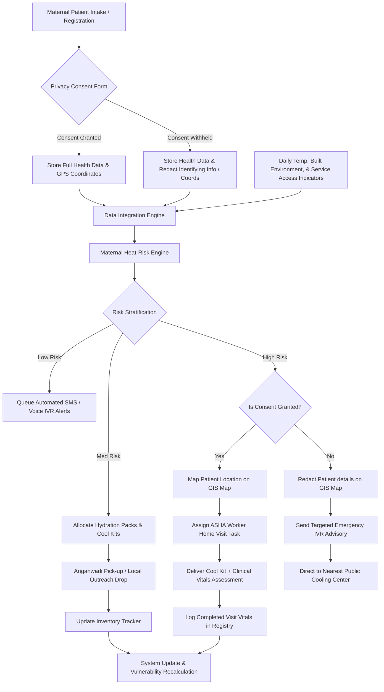

# Field-Workflow Map: Maternal Child Health Heat-Risk response

This document visualizes the operational flow, from patient intake and environmental monitoring to optimized response planning and field execution.

### Operational Steps Description

1. **Intake and Consent**: During standard antenatal care visits, pregnant women are enrolled in the MCH tracking database. They choose whether to consent to active home visits, which requires sharing their precise location. If they opt-out (consent withheld), they are de-identified to protect privacy, appearing only as aggregated statistics at the ward level.
2. **Data Integration**: The engine pulls environmental data (land surface temperature, building density) and combines it with MCH clinical data (gestational age, pre-existing conditions).
3. **Risk Stratification**: Patients are classified into Low, Medium, and High heat-risk categories daily.
4. **Optimized Dispatch**:
   - **Low-Risk** receives cheap, automated digital advice.
   - **Medium-Risk** receives cooling materials distributed through local schools or self-collection.
   - **High-Risk** receives face-to-face clinical interventions from ASHA workers, provided they have granted location sharing consent. If consent is withheld, safety calls are triggered without exposing exact home addresses.
